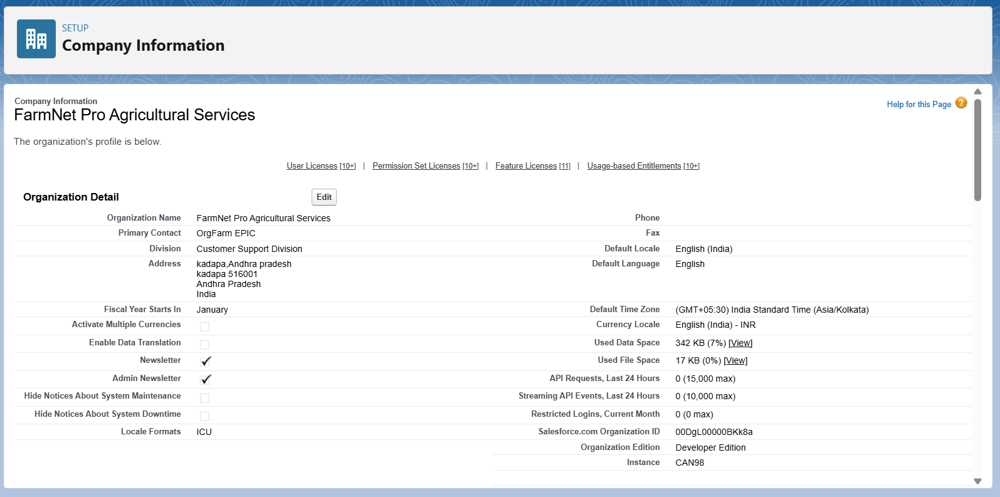
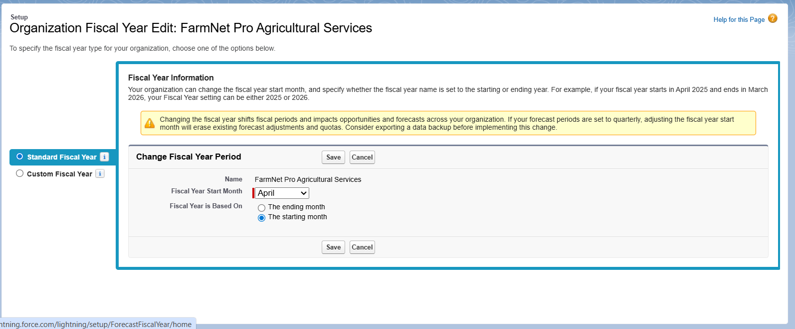
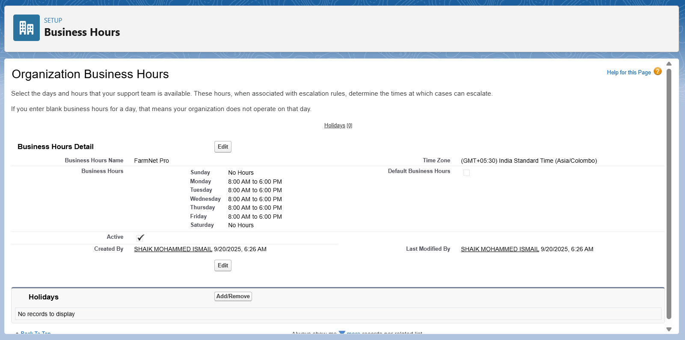
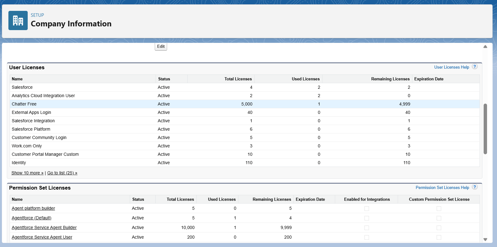
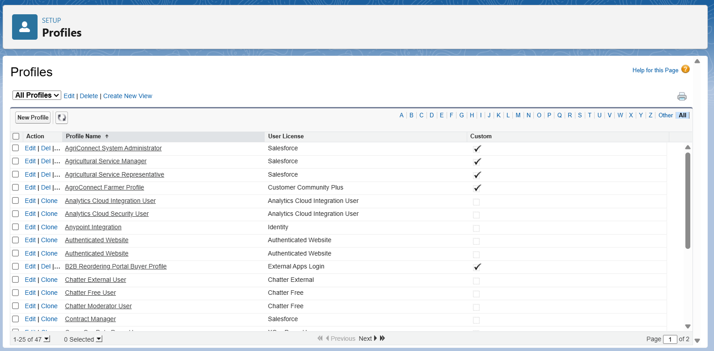

# AgriConnect Simple - Phase 2 Documentation
## Standard Org Setup and Basic Configuration

**Project Title:** AgriConnect Simple - Agricultural Customer Management System  
**Industry:** Agriculture  
**Type:** B2B Agricultural CRM for Farmer Support Services  
**Developer:** TCS LastMile Phase 2 Participant  
**Date:** September 20, 2025  
**Phase Status:** Phase 2 Complete  
**Complexity Level:** EASY - Basic Salesforce CRM Implementation

---

## **PHASE 2: STANDARD ORG SETUP AND BASIC CONFIGURATION**

This phase establishes a basic Salesforce organization with standard configuration to support AgriConnect Simple's agricultural service management needs. The setup focuses on simple, standard Salesforce functionality that is easy to implement and maintain.

---

## **1. BASIC SALESFORCE ORG SETUP**

### **1.1 Developer Edition Organization Setup**

**Basic Org Configuration:**
- **Edition:** Developer Edition (free for development and testing)
- **Company Type:** Agricultural Service Provider
- **Primary Use:** Customer relationship management for agricultural services

**Navigation Steps:**
1. **Access Org:** Log into your Salesforce Developer org
2. **Navigate to Setup:** Click the **Gear Icon (⚙️)** → Select **Setup**
3. **Company Information:** Quick Find → Type "Company Information" → Click **Company Information**
4. **Edit Basic Details:** Click **Edit** → Update company information → **Save**

**Company Details to Configure:**
- **Company Name:** AgriConnect Simple Agricultural Services
- **Division:** Customer Support Division
- **Department:** Agricultural Services
- **Industry:** Agriculture & Food Production
- **Company Type:** Service Provider

### **1.2 Basic Indian Localization**

**Regional Settings Configuration:**
1. **Navigate:** Setup → Quick Find → "Company Information"
2. **Edit Settings:** Click **Edit** → Configure regional preferences
3. **Save Changes:** Apply Indian business settings

**Localization Settings:**
- **Country:** India
- **State:** Karnataka (or your local state)
- **Time Zone:** (GMT+05:30) Chennai, Kolkata, Mumbai, New Delhi
- **Language:** English
- **Currency:** Indian Rupee (₹)
- **Date Format:** DD/MM/YYYY

---

## **2. BASIC BUSINESS CALENDAR SETUP**

### **2.1 Standard Fiscal Year Configuration**

**Agricultural Business Calendar:**
1. **Navigate:** Setup → Quick Find → "Fiscal Year"
2. **Configure:** Select Standard Fiscal Year
3. **Set Period:** April to March (aligns with Indian agricultural calendar)

**Fiscal Year Setup:**
- **Start Month:** April (crop planning season)
- **End Month:** March (harvest season end)
- **Type:** Standard Fiscal Year
- **Current Year:** FY 2025-26


### **2.2 Basic Business Hours**

**Service Hours Configuration:**
1. **Navigate:** Setup → Quick Find → "Business Hours"
2. **Create New:** Click **New** → Configure service hours
3. **Set Schedule:** Monday-Saturday 8:00 AM - 6:00 PM IST

**Business Hours:**
- **Service Hours:** Monday-Saturday 8:00 AM - 6:00 PM IST
- **Field Service:** Extended hours for farm visits (7:00 AM - 7:00 PM)
- **Emergency Support:** Contact information for urgent agricultural issues

---

## **3. SIMPLE USER MANAGEMENT**

### **3.1 Basic User Licenses**

**License Planning:**
1. **Navigate:** Setup → Quick Find → "Company Information"
2. **Review Licenses:** Check available user licenses in Developer org
3. **Plan Usage:** Allocate licenses for different user types

**Available Licenses (Developer Org):**
- **Salesforce Platform:** 2 licenses (System Admin, Manager)
- **Salesforce:** Limited licenses for additional users
- **Chatter Free:** Unlimited (basic collaboration)

### **3.2 Simple Profile Creation**

**Basic Profile Setup:**
1. **Navigate:** Setup → Quick Find → "Profiles"
2. **Clone Standard Profiles:** Select base profile → Click **Clone**
3. **Customize Permissions:** Edit for agricultural service needs

### **3.3 AgriConnect System Administrator Profile**

**Profile Creation Steps:**
1. **Base Profile:** Clone "System Administrator"
2. **Profile Name:** "AgriConnect System Administrator"
3. **Keep Standard Permissions:** Full system access

**Administrator Permissions:**
- **Full Administrative Access:** Complete system configuration and user management
- **Data Management:** Import/export farmer data and system records
- **Report Administration:** Create and manage reports and dashboards
- **User Management:** Create user accounts and assign profiles


### **3.4 Agricultural Service Representative Profile**

**Profile Creation Steps:**
1. **Base Profile:** Clone "Standard User"
2. **Profile Name:** "Agricultural Service Representative"
3. **Configure Field Access:** Enable access to farmer and service data

**Service Rep Permissions:**
- **Farmer Management:** Full access to assigned farmer accounts and contacts
- **Service Tracking:** Create and edit service visit records and activities
- **Communication:** Send emails and track communication with farmers
- **Mobile Access:** Full mobile app functionality for field work
- **Reporting:** Access to standard reports relevant to their territory

**Object Permissions:**
- **Account:** Read/Edit for assigned farmers
- **Contact:** Read/Edit for farmer contacts  
- **Task/Event:** Full CRUD for service activities
- **Case:** Create/Edit for farmer service requests
- **Opportunity:** Read/Edit for service sales opportunities

### **3.5 Agricultural Service Manager Profile**

**Profile Creation Steps:**
1. **Base Profile:** Clone "Standard User"  
2. **Profile Name:** "Agricultural Service Manager"
3. **Configure Management Access:** Enable team oversight and reporting

**Manager Permissions:**
- **Team Oversight:** Read access to all farmer data within region
- **Performance Management:** Access to team reports and dashboards
- **Service Planning:** Manage service schedules and resource allocation
- **Data Analysis:** Advanced reporting and analytics access
- **User Support:** Assist service reps with system questions

**Object Permissions:**
- **Account:** Read access to all farmers in region
- **Contact:** Read access to all farmer contacts
- **Task/Event:** Read access to team activities
- **Reports:** Full access to performance and business reports

---

## **4. BASIC ROLE HIERARCHY**

### **4.1 Simple Role Structure**

**Role Hierarchy Setup:**
1. **Navigate:** Setup → Quick Find → "Roles"
2. **Set Up Roles:** Click **Set Up Roles** (if not configured)
3. **Create Agricultural Roles:** Add simple role structure

**Basic Role Hierarchy:**
```
AgriConnect Director
├── North Region Manager
├── South Region Manager
├── East Region Manager
├── West Region Manager
    ├── District Service Manager - Bangalore
    ├── District Service Manager - Pune
    ├── District Service Manager - Chennai
        ├── Service Representative - Zone A
        ├── Service Representative - Zone B
        ├── Service Representative - Zone C
```

**Role Configuration:**
- **Geographic Structure:** Simple regional and district organization
- **Functional Clarity:** Clear reporting relationships
- **Data Access:** Higher roles can access subordinate data
- **Scalable Design:** Easy to add new regions and representatives

---

## **5. BASIC SECURITY SETTINGS**

### **5.1 Organization-Wide Defaults (OWD)**

**Security Configuration Steps:**
1. **Navigate:** Setup → Quick Find → "Sharing Settings"
2. **Set OWD:** Configure default access levels for each object
3. **Apply Settings:** Save organization-wide security configuration

**Simple Security Model:**
- **Account (Farmers):** Private (service reps see only assigned farmers)
- **Contact:** Controlled by Parent (follows Account access)
- **Lead:** Private (prospects assigned to specific reps)
- **Opportunity:** Private (service opportunities assigned to reps)
- **Case:** Private (service requests handled by assigned reps)
- **Task/Event:** Private (activities visible only to creator and manager)

### **5.2 Basic Sharing Rules**

**Territory-Based Sharing:**
1. **Navigate:** Sharing Settings → Sharing Rules section
2. **Create Rules:** Click **New** for each object needing shared access
3. **Configure Access:** Set up geographic territory sharing

**Simple Sharing Rules:**

**Rule 1: Manager Territory Access**
- **Object:** Account (Farmer records)
- **Rule Name:** District Manager Farmer Access
- **Criteria:** Account Region = Manager Region
- **Share With:** Role and Subordinates → District Service Manager
- **Access Level:** Read/Write

**Rule 2: Service Rep Collaboration**
- **Object:** Account
- **Rule Name:** Service Rep District Collaboration  
- **Criteria:** Account District = User District
- **Share With:** Role → Service Representatives in District
- **Access Level:** Read-Only

---

## **6. BASIC EMAIL AND COMMUNICATION SETUP**

### **6.1 Email Integration**

**Email Setup Steps:**
1. **Navigate:** Setup → Quick Find → "Deliverability"
2. **Enable Email:** Set deliverability to "All Email"
3. **Configure Templates:** Set up basic email templates for farmer communication

**Email Configuration:**
- **Deliverability:** Enabled for all users
- **Email-to-Case:** Basic setup for farmer inquiries
- **Email Templates:** Standard templates for service communication

### **6.2 Basic Email Templates**

**Template Creation Steps:**
1. **Navigate:** Setup → Quick Find → "Email Templates"
2. **Create Templates:** Click **New Template** for each communication type
3. **Configure Content:** Add agricultural service messaging

**Standard Email Templates:**
- **Service Visit Confirmation:** Confirm scheduled farm visits
- **Follow-up Reminder:** Remind farmers about recommended services
- **Seasonal Advisory:** Share seasonal agricultural advice and tips
- **Service Completion:** Confirm completed services and next steps

---

## **7. MOBILE APP CONFIGURATION**

### **7.1 Salesforce Mobile App Setup**

**Mobile Configuration Steps:**
1. **Navigate:** Setup → Quick Find → "Salesforce Mobile App"
2. **Configure Navigation:** Set up mobile navigation for agricultural workflows
3. **Enable Offline:** Configure offline access for field representatives

**Mobile Features:**
- **Farmer Records:** Access farmer information while visiting farms
- **Service Tracking:** Record service visits and activities from mobile
- **Communication:** Send emails and make calls directly from farmer records
- **Navigation:** GPS integration for farm location and visit routing

### **7.2 Mobile Navigation Setup**

**Navigation Configuration:**
1. **Navigate:** Setup → Mobile Apps → Salesforce → Navigation
2. **Configure Menu:** Add relevant items for agricultural service reps
3. **Test Access:** Verify mobile functionality for field use

**Mobile Navigation Items:**
- **Today's Visits:** Quick access to scheduled farm visits
- **My Farmers:** List of assigned farmer accounts
- **New Service Visit:** Quick service visit creation
- **Recent Activity:** Latest farmer interactions and follow-ups

---

## **8. BASIC REPORTING SETUP**

### **8.1 Standard Reports Creation**

**Report Configuration Steps:**
1. **Navigate:** Click **App Launcher** → Search "Reports"
2. **Create New Reports:** Click **New Report** for each business need
3. **Save in Folder:** Organize reports in Agricultural Services folder

**Essential Reports:**
- **Farmer Contact List:** Complete list of farmers by territory
- **Service Visit Summary:** Monthly service visits by representative
- **Open Service Requests:** Cases requiring attention
- **Opportunity Pipeline:** Potential service sales by stage

### **8.2 Basic Dashboard Setup**

**Dashboard Creation Steps:**
1. **Navigate:** App Launcher → Search "Dashboards"
2. **Create Dashboard:** Click **New Dashboard**
3. **Add Components:** Include key performance metrics

**Manager Dashboard Components:**
- **Service Visits This Month:** Track team service delivery
- **Open Cases by Rep:** Monitor service request handling
- **Farmer Engagement:** Track communication and interaction frequency
- **Opportunity Pipeline:** Monitor potential service sales

---

## **9. DATA IMPORT PREPARATION**

### **9.1 Data Import Wizard Setup**

**Import Preparation Steps:**
1. **Navigate:** Setup → Quick Find → "Data Import Wizard"
2. **Review Options:** Check available import options for different objects
3. **Prepare Templates:** Download CSV templates for data migration

**Import Capabilities:**
- **Accounts:** Import existing farmer records from Excel
- **Contacts:** Import farmer contact information
- **Leads:** Import potential new farmers
- **Activities:** Import historical service visit data

### **9.2 Basic Data Validation**

**Data Quality Rules:**
1. **Navigate:** Setup → Quick Find → "Validation Rules"
2. **Create Rules:** Click **New** for each object requiring validation
3. **Configure Logic:** Set up simple data quality checks

**Basic Validation Rules:**
- **Phone Number Format:** Ensure consistent phone number format
- **Email Validation:** Verify email address format
- **Required Fields:** Ensure critical farmer information is complete
- **Date Validation:** Verify service dates are logical and current

---

## **10. BASIC INTEGRATION SETUP**

### **10.1 Email-to-Lead Setup**

**Lead Generation Configuration:**
1. **Navigate:** Setup → Quick Find → "Email-to-Lead"
2. **Enable Feature:** Activate email-to-lead functionality
3. **Configure Settings:** Set up automatic lead creation from emails

**Email-to-Lead Configuration:**
- **Lead Source:** Website Inquiry, Phone Call, Referral
- **Lead Assignment:** Automatic assignment to regional service reps
- **Notification:** Email alerts for new lead creation
- **Follow-up:** Automatic task creation for lead follow-up

### **10.2 Web-to-Lead Setup**

**Online Lead Capture:**
1. **Navigate:** Setup → Quick Find → "Web-to-Lead"
2. **Generate Form:** Create lead capture form for website
3. **Configure Fields:** Include relevant farmer information fields

**Web Form Fields:**
- **Basic Information:** Name, Phone, Email, Farm Location
- **Service Interest:** Type of agricultural service needed
- **Best Contact Time:** When to contact the potential farmer
- **Additional Notes:** Specific farming challenges or requirements

---

## **11. BASIC WORKFLOW AUTOMATION**

### **11.1 Simple Workflow Rules**

**Workflow Creation Steps:**
1. **Navigate:** Setup → Quick Find → "Workflow Rules"
2. **Create Rules:** Click **New Rule** for each automation need
3. **Configure Actions:** Set up automatic actions for common processes

**Essential Workflow Rules:**

**Rule 1: New Farmer Welcome**
- **Object:** Account
- **Criteria:** Account Created AND Type = Farmer
- **Action:** Send welcome email template
- **Follow-up:** Create task for initial service visit

**Rule 2: Service Visit Follow-up**
- **Object:** Task  
- **Criteria:** Task Subject contains "Service Visit" AND Status = Completed
- **Action:** Create follow-up task for next service planning
- **Notification:** Email manager about completed service

**Rule 3: Case Assignment**
- **Object:** Case
- **Criteria:** Case Origin = Email AND Status = New
- **Action:** Assign to queue based on farmer location
- **Notification:** Email assigned service rep

---

## **12. BASIC TRAINING PREPARATION**

### **12.1 User Training Materials**

**Training Content Creation:**
1. **Basic User Guides:** Simple PDF guides for each user role
2. **Video Tutorials:** Screen recordings of common tasks
3. **Quick Reference Cards:** Printable cards for mobile and desktop use

**Training Topics:**
- **System Login:** How to access AgriConnect Simple
- **Farmer Management:** Creating and updating farmer records
- **Service Tracking:** Recording service visits and activities
- **Mobile App Usage:** Using Salesforce mobile app in the field
- **Basic Reporting:** Running reports and viewing dashboards

### **12.2 System Testing**

**Testing Checklist:**
✅ **User Login:** All profiles can access system with appropriate permissions  
✅ **Mobile Access:** Mobile app works for service representatives in field  
✅ **Data Entry:** Can create and edit farmer records and service activities  
✅ **Email Integration:** Email templates work for farmer communication  
✅ **Reporting:** Basic reports display correct information  
✅ **Workflow Automation:** Automated processes trigger correctly  

---

## **13. PHASE 2 COMPLETION CHECKLIST**

### **13.1 Basic Configuration Completed**

✅ **Salesforce Org Setup:** Basic company information and regional settings configured  
✅ **User Management:** Three profiles created (Admin, Service Rep, Manager) with appropriate permissions  
✅ **Role Hierarchy:** Simple geographic and functional role structure established  
✅ **Security Model:** Basic OWD and sharing rules for farmer data protection  
✅ **Email Integration:** Basic email templates and deliverability configured  
✅ **Mobile Setup:** Salesforce mobile app configured for field service representatives  
✅ **Basic Reporting:** Essential reports and manager dashboard created  
✅ **Data Import:** Data Import Wizard configured for farmer record migration  
✅ **Simple Automation:** Basic workflow rules for common agricultural service processes  
✅ **Training Preparation:** User guides and training materials prepared for system adoption  

### **13.2 System Readiness Verification**

**Functional Testing:**
- ✅ **User Profiles:** All profiles tested with appropriate access and restrictions
- ✅ **Mobile Access:** Mobile functionality confirmed for field service work
- ✅ **Email Communication:** Email templates tested for farmer communication
- ✅ **Data Security:** Role-based access working correctly for different user types
- ✅ **Automation:** Workflow rules triggering appropriate actions

**User Experience:**
- ✅ **Navigation:** Intuitive navigation for agricultural service workflows
- ✅ **Mobile Optimization:** Mobile app optimized for field representatives
- ✅ **Performance:** System response times acceptable for daily use
- ✅ **Training Materials:** User guides prepared for different roles

---

## **14. NEXT PHASE PREPARATION**

### **14.1 Phase 3 Requirements - Simple Data Model**

**Custom Object Planning:**
- **Farmer__c:** Basic farmer information beyond standard Account/Contact
- **Crop_Season__c:** Simple seasonal crop tracking
- **Service_Visit__c:** Detailed service visit records
- **Product_Usage__c:** Track agricultural products used or recommended

**Relationship Planning:**
- **Simple Lookups:** Basic relationships between farmers and services
- **No Complex Hierarchies:** Keep data model simple and intuitive
- **Standard Functionality:** Leverage standard Salesforce features where possible

### **14.2 Expected Phase 3 Outcomes**

✅ **Custom Objects:** 3-4 simple custom objects for agricultural-specific data  
✅ **Basic Relationships:** Simple lookup relationships between objects  
✅ **Page Layouts:** User-friendly layouts for data entry and viewing  
✅ **List Views:** Organized views of farmers, services, and activities  
✅ **Basic Validation:** Simple rules ensuring data quality and consistency  

---

## **15. BUSINESS VALUE DELIVERED**

### **15.1 Immediate Benefits**

**Organizational Improvement:**
- **Centralized Database:** All farmer information in one accessible location
- **Mobile Field Access:** Service reps can access farmer data while visiting farms
- **Automated Communication:** Email templates ensure consistent farmer communication
- **Basic Reporting:** Managers have visibility into team performance and farmer engagement

**Operational Efficiency:**
- **Reduced Search Time:** Quick access to farmer contact and service history
- **Improved Follow-up:** Automatic reminders ensure no service opportunities are missed
- **Consistent Processes:** Standardized workflows for service delivery and communication
- **Data Quality:** Validation rules ensure accurate and complete farmer information

### **15.2 Foundation for Growth**

**Scalable Platform:**
- **User Expansion:** Easy to add more service representatives and managers
- **Geographic Growth:** Role hierarchy supports expansion to new regions
- **Feature Enhancement:** Standard Salesforce platform allows for future enhancements
- **Integration Ready:** Foundation prepared for future system integrations

**Data-Driven Insights:**
- **Performance Tracking:** Basic metrics on service delivery and farmer engagement
- **Business Intelligence:** Reports support data-driven decision making
- **Process Improvement:** Usage data identifies opportunities for workflow optimization
- **Customer Satisfaction:** Track farmer response to services and communication

---

**Phase 2 Completion Status:** ✅ **COMPLETE**  
**Phase 2 Documentation Created:** September 20, 2025  
**Next Phase:** Phase 3 - Simple Data Model Creation  
**Estimated Phase 3 Completion:** September 21, 2025  
**Project Timeline Status:** On track for September 26 final submission

**System Status:** ✅ **Basic Salesforce org configured and ready for agricultural service management**  
**User Access:** ✅ **Three user profiles configured with appropriate permissions and mobile access**  
**Business Process:** ✅ **Simple workflows and automation configured for common agricultural service tasks**  
**Training Readiness:** ✅ **User guides and training materials prepared for system adoption**  
**Implementation Approach:** ✅ **SIMPLE and PRACTICAL - Easy to implement and maintain agricultural CRM**