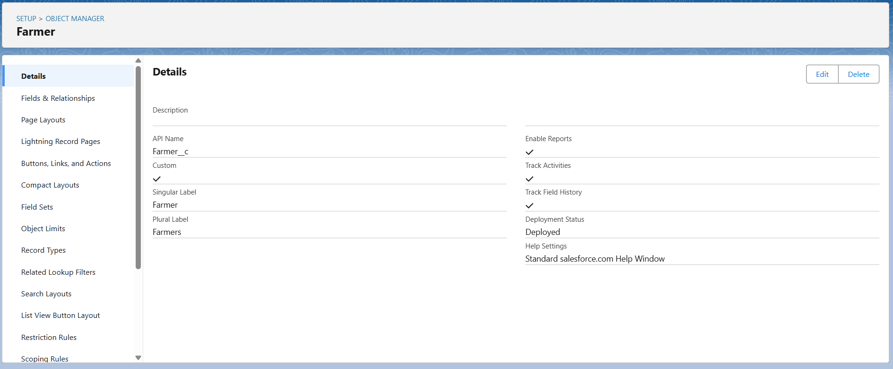
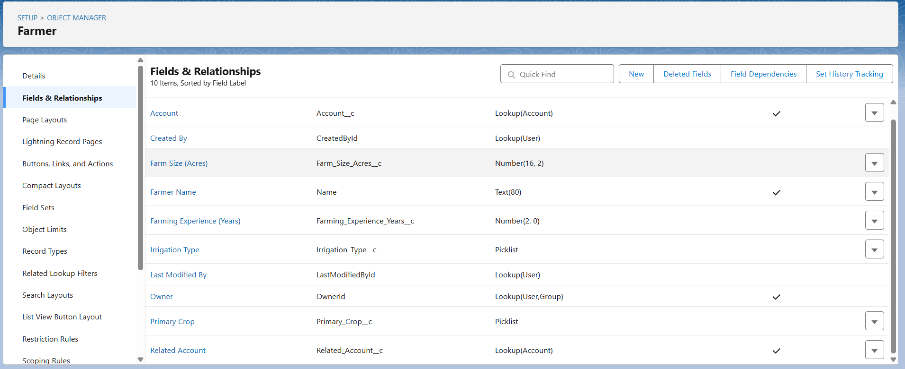
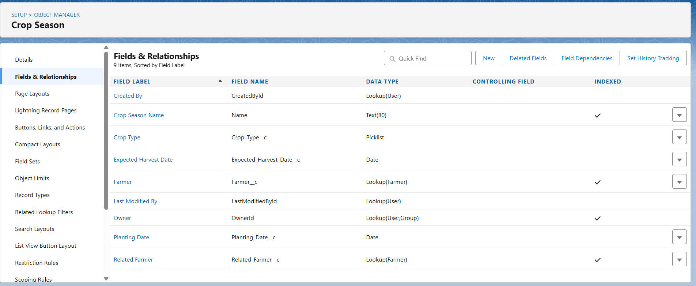

# AgriConnect Simple - Phase 3 Implementation Guide
## Simple Data Model Creation and Relationships

**Project Title:** AgriConnect Simple - Agricultural Customer Management System  
**Industry:** Agriculture  
**Type:** B2B Agricultural CRM for Farmer Support Services  
**Developer:** TCS LastMile Phase 2 Participant  
**Date:** September 22, 2025  
**Phase Status:** Phase 3 Implementation Guide  
**Complexity Level:** EASY - Basic Custom Objects and Simple Relationships

---

## PHASE 3: SIMPLE DATA MODEL CREATION

This phase creates basic custom objects to store agricultural-specific data that extends beyond standard Salesforce objects, establishing simple relationships to support AgriConnect Simple's farmer service management workflows based on requirements from Phase 1 and the org foundation established in Phase 2.

---

## 📋 IMPLEMENTATION CHECKLIST

### ✅ Pre-Implementation Requirements
- [ ] Phase 2 org setup completed successfully
- [ ] User profiles and security model configured
- [ ] Standard Salesforce objects (Account, Contact, Case, Task) verified
- [ ] Object-level permissions reviewed for all profiles

### ✅ Phase 3 Deliverables
- [ ] 4 custom objects created with appropriate fields
- [ ] Simple lookup relationships established
- [ ] Page layouts configured for all user types
- [ ] List views created for data organization
- [ ] Validation rules implemented for data quality
- [ ] All screenshots captured and documented

---

## 1. AGRICULTURAL CUSTOM OBJECTS OVERVIEW

### 1.1 Custom Objects Strategy

**Simple Data Model Approach:**
- **Farmer__c:** Extended farmer information beyond Account/Contact
- **Crop_Season__c:** Basic seasonal crop tracking and planning
- **Service_Visit__c:** Detailed agricultural service visit records
- **Product_Usage__c:** Track agricultural products recommended/used

**Relationship Strategy:**
- Use simple **Lookup relationships** for easy navigation
- Avoid complex **Master-Detail** relationships for simplicity
- Leverage standard Salesforce functionality where possible
- Keep field types simple (Text, Number, Date, Picklist)

### 1.2 Data Model Architecture

```
Standard Objects → Custom Objects Integration:
Account (Organization) → Farmer__c (Detailed Info)
Contact (Person) → Service_Visit__c (Interactions)
Task/Event (Activities) → Service_Visit__c (Structured Visits)
Product2 (Standard) → Product_Usage__c (Agricultural Usage)
```

---

## 2. CUSTOM OBJECT CREATION - FARMER

### 2.1 Farmer__c Object Setup

**Navigation Path:**
```
Setup → Quick Find → "Object Manager" → Create → Custom Object
```

**Implementation Steps:**
1. **Navigate:** Setup → Quick Find → "Object Manager" → Click **Object Manager**
2. **Create Object:** Click **Create** → Select **Custom Object**
3. **Object Configuration:**
   - **Label:** Farmer
   - **Plural Label:** Farmers
   - **Object Name:** Farmer__c
   - **Description:** Extended farmer information for agricultural services
4. **Record Name Configuration:**
   - **Data Type:** Text
   - **Display Format:** Farmer-{0000}
5. **Object Features:** Enable Reports, Activities, Search, History Tracking
6. **Save Object:** Apply farmer object configuration

**📸 Screenshot Instructions:**
- **Navigate:** Setup → Object Manager → Farmer__c → Details
- **Action:** After creating Farmer object, capture screenshot
- **Include:** Object name, label, API name, and enabled features visible
- **Caption:** "Figure 2.1: Farmer custom object created with basic configuration"

### 2.2 Farmer Custom Fields Creation

**Navigation Path:**
```
Setup → Object Manager → Farmer__c → Fields & Relationships → New
```

**Implementation Steps:**

**Field 1: Farm Size**
1. **Navigate:** Farmer__c → Fields & Relationships → Click **New**
2. **Field Type:** Number (16, 2)
3. **Field Configuration:**
   - **Field Label:** Farm Size (Acres)
   - **Field Name:** Farm_Size_Acres__c
   - **Description:** Total cultivable land area in acres
4. **Field Security:** Visible to all profiles
5. **Page Layout:** Add to all layouts

**Field 2: Primary Crop**
1. **Field Type:** Picklist
2. **Field Configuration:**
   - **Field Label:** Primary Crop
   - **Field Name:** Primary_Crop__c
   - **Values:** Rice, Wheat, Cotton, Sugarcane, Vegetables, Fruits, Other
3. **Default Value:** (Leave blank for user selection)

**Field 3: Irrigation Type**
1. **Field Type:** Picklist
2. **Field Configuration:**
   - **Field Label:** Irrigation Type
   - **Field Name:** Irrigation_Type__c
   - **Values:** Bore Well, Canal, Rain Fed, Drip Irrigation, Sprinkler
3. **Field Security:** Visible to all profiles

**Field 4: Farming Experience**
1. **Field Type:** Number (2, 0)
2. **Field Configuration:**
   - **Field Label:** Farming Experience (Years)
   - **Field Name:** Farming_Experience_Years__c
   - **Description:** Number of years in farming
3. **Validation:** Must be between 0 and 70

**Field 5: Account Lookup**
1. **Field Type:** Lookup Relationship
2. **Field Configuration:**
   - **Field Label:** Related Account
   - **Field Name:** Account__c
   - **Related To:** Account
   - **Description:** Link to farmer's account record
3. **Required:** Make field required

**📸 Screenshot Instructions:**
- **Navigate:** Object Manager → Farmer__c → Fields & Relationships
- **Action:** After creating all fields, capture screenshot
- **Include:** List of all 5 custom fields with their types and API names
- **Caption:** "Figure 2.2: Farmer custom fields created for agricultural data"

---

## 3. CUSTOM OBJECT CREATION - CROP SEASON

### 3.1 Crop_Season__c Object Setup

**Navigation Path:**
```
Setup → Object Manager → Create → Custom Object
```

**Implementation Steps:**
1. **Navigate:** Setup → Object Manager → Create → Custom Object
2. **Object Configuration:**
   - **Label:** Crop Season
   - **Plural Label:** Crop Seasons  
   - **Object Name:** Crop_Season__c
   - **Description:** Track seasonal crop planning and cycles
3. **Record Name:** Crop Season-{0000}
4. **Features:** Enable Reports, Activities, Search
5. **Save Configuration:** Apply crop season object settings

**📸 Screenshot Instructions:**
- **Navigate:** Setup → Object Manager → Crop_Season__c → Details
- **Action:** After creating object, capture screenshot
- **Include:** Object label, API name, and record name format
- **Caption:** "Figure 3.1: Crop Season object created for seasonal tracking"

### 3.2 Crop Season Custom Fields

**Field 1: Season Type**
1. **Field Type:** Picklist
2. **Configuration:**
   - **Field Label:** Season Type
   - **Field Name:** Season_Type__c
   - **Values:** Kharif (Summer), Rabi (Winter), Zaid (Spring)
3. **Required:** Yes

**Field 2: Crop Name**
1. **Field Type:** Picklist
2. **Configuration:**
   - **Field Label:** Crop Name
   - **Field Name:** Crop_Name__c
   - **Values:** Rice, Wheat, Cotton, Sugarcane, Maize, Pulses, Vegetables
3. **Required:** Yes

**Field 3: Planting Date**
1. **Field Type:** Date
2. **Configuration:**
   - **Field Label:** Planting Date
   - **Field Name:** Planting_Date__c
   - **Description:** Expected or actual planting date

**Field 4: Harvest Date**
1. **Field Type:** Date  
2. **Configuration:**
   - **Field Label:** Expected Harvest Date
   - **Field Name:** Harvest_Date__c
   - **Description:** Projected harvest completion date

**Field 5: Farmer Lookup**
1. **Field Type:** Lookup Relationship
2. **Configuration:**
   - **Field Label:** Farmer
   - **Field Name:** Farmer__c
   - **Related To:** Farmer__c
   - **Description:** Link to farmer record
3. **Required:** Yes

**📸 Screenshot Instructions:**
- **Navigate:** Object Manager → Crop_Season__c → Fields & Relationships
- **Action:** After creating all fields, capture screenshot  
- **Include:** All 5 fields showing types, labels, and required status
- **Caption:** "Figure 3.2: Crop Season fields configured for seasonal planning"

---

## 4. CUSTOM OBJECT CREATION - SERVICE VISIT

### 4.1 Service_Visit__c Object Setup

**Navigation Path:**
```
Setup → Object Manager → Create → Custom Object
```

**Implementation Steps:**
1. **Navigate:** Setup → Object Manager → Create → Custom Object
2. **Object Configuration:**
   - **Label:** Service Visit
   - **Plural Label:** Service Visits
   - **Object Name:** Service_Visit__c  
   - **Description:** Track agricultural service visits and activities
3. **Record Name:** SV-{0000}
4. **Features:** Enable Reports, Activities, Search, History Tracking
5. **Save Configuration:** Apply service visit object settings

### 4.2 Service Visit Custom Fields

**Field 1: Visit Date**
1. **Field Type:** Date/Time
2. **Configuration:**
   - **Field Label:** Visit Date
   - **Field Name:** Visit_Date__c
   - **Description:** Date and time of service visit
3. **Required:** Yes

**Field 2: Service Type**
1. **Field Type:** Picklist
2. **Configuration:**
   - **Field Label:** Service Type  
   - **Field Name:** Service_Type__c
   - **Values:** Consultation, Soil Testing, Pest Control, Equipment Service, Training
3. **Required:** Yes

**Field 3: Visit Status**
1. **Field Type:** Picklist
2. **Configuration:**
   - **Field Label:** Visit Status
   - **Field Name:** Visit_Status__c
   - **Values:** Planned, In Progress, Completed, Cancelled
   - **Default:** Planned
3. **Required:** Yes

**Field 4: Service Notes**
1. **Field Type:** Long Text Area
2. **Configuration:**
   - **Field Label:** Service Notes
   - **Field Name:** Service_Notes__c
   - **Length:** 5000 characters
   - **Visible Lines:** 5

**Field 5: Farmer Lookup**
1. **Field Type:** Lookup Relationship
2. **Configuration:**
   - **Field Label:** Farmer
   - **Field Name:** Farmer__c
   - **Related To:** Farmer__c
3. **Required:** Yes

**Field 6: Service Representative**
1. **Field Type:** Lookup Relationship  
2. **Configuration:**
   - **Field Label:** Service Representative
   - **Field Name:** Service_Representative__c
   - **Related To:** User
   - **Description:** Assigned service rep for visit
3. **Required:** Yes

**📸 Screenshot Instructions:**
- **Navigate:** Object Manager → Service_Visit__c → Fields & Relationships
- **Action:** After creating all 6 fields, capture screenshot
- **Include:** Field list showing Visit Date, Service Type, Status, Notes, and lookup relationships
- **Caption:** "Figure 4.1: Service Visit fields created for visit tracking"

---

## 5. CUSTOM OBJECT CREATION - PRODUCT USAGE

### 5.1 Product_Usage__c Object Setup

**Navigation Path:**
```
Setup → Object Manager → Create → Custom Object
```

**Implementation Steps:**
1. **Navigate:** Setup → Object Manager → Create → Custom Object
2. **Object Configuration:**
   - **Label:** Product Usage
   - **Plural Label:** Product Usage Records
   - **Object Name:** Product_Usage__c
   - **Description:** Track agricultural products recommended or used
3. **Record Name:** PU-{0000}
4. **Features:** Enable Reports, Activities, Search
5. **Save Configuration:** Apply product usage object settings

### 5.2 Product Usage Custom Fields

**Field 1: Product Name**
1. **Field Type:** Text
2. **Configuration:**
   - **Field Label:** Product Name
   - **Field Name:** Product_Name__c
   - **Length:** 80 characters
3. **Required:** Yes

**Field 2: Product Type**
1. **Field Type:** Picklist
2. **Configuration:**
   - **Field Label:** Product Type
   - **Field Name:** Product_Type__c
   - **Values:** Fertilizer, Pesticide, Herbicide, Seeds, Equipment, Other
3. **Required:** Yes

**Field 3: Quantity Used**
1. **Field Type:** Number (10, 2)
2. **Configuration:**
   - **Field Label:** Quantity Used
   - **Field Name:** Quantity_Used__c
   - **Description:** Amount of product used or recommended

**Field 4: Usage Date**
1. **Field Type:** Date
2. **Configuration:**
   - **Field Label:** Usage Date
   - **Field Name:** Usage_Date__c
   - **Description:** Date when product was used or recommended

**Field 5: Farmer Lookup**
1. **Field Type:** Lookup Relationship
2. **Configuration:**
   - **Field Label:** Farmer
   - **Field Name:** Farmer__c
   - **Related To:** Farmer__c
3. **Required:** Yes

**Field 6: Service Visit Lookup**
1. **Field Type:** Lookup Relationship
2. **Configuration:**
   - **Field Label:** Related Service Visit
   - **Field Name:** Service_Visit__c
   - **Related To:** Service_Visit__c
   - **Description:** Link to service visit where product was recommended

**📸 Screenshot Instructions:**
- **Navigate:** Object Manager → Product_Usage__c → Fields & Relationships
- **Action:** After creating all fields, capture screenshot
- **Include:** All 6 fields with types and relationship connections visible
- **Caption:** "Figure 5.1: Product Usage fields created for agricultural product tracking"

---

## 6. PAGE LAYOUTS CONFIGURATION

### 6.1 Farmer Page Layout Setup

**Navigation Path:**
```
Setup → Object Manager → Farmer__c → Page Layouts → Farmer Layout
```

**Implementation Steps:**
1. **Navigate:** Object Manager → Farmer__c → Page Layouts
2. **Edit Layout:** Click **Farmer Layout**
3. **Layout Configuration:**
   - **Section 1:** Farmer Information
     - Farm Size (Acres)
     - Primary Crop  
     - Irrigation Type
     - Farming Experience (Years)
   - **Section 2:** Account Information
     - Related Account (lookup)
   - **Section 3:** System Information
     - Created By, Created Date
     - Last Modified By, Last Modified Date
4. **Save Layout:** Apply farmer page layout configuration

**📸 Screenshot Instructions:**
- **Navigate:** Object Manager → Farmer__c → Page Layouts → Farmer Layout (edit mode)
- **Action:** After configuring layout sections, capture screenshot
- **Include:** Layout editor showing sections and field placement
- **Caption:** "Figure 6.1: Farmer page layout configured with agricultural fields"

### 6.2 Service Visit Page Layout Setup

**Navigation Path:**
```
Setup → Object Manager → Service_Visit__c → Page Layouts → Service Visit Layout
```

**Implementation Steps:**
1. **Navigate:** Object Manager → Service_Visit__c → Page Layouts
2. **Edit Layout:** Click **Service Visit Layout**
3. **Layout Configuration:**
   - **Section 1:** Visit Details
     - Visit Date
     - Service Type
     - Visit Status
   - **Section 2:** Relationships
     - Farmer (lookup)
     - Service Representative (lookup)
   - **Section 3:** Visit Information
     - Service Notes
   - **Section 4:** System Information
     - Created By, Last Modified By
4. **Save Layout:** Apply service visit layout

**📸 Screenshot Instructions:**
- **Navigate:** Object Manager → Service_Visit__c → Page Layouts → Service Visit Layout (edit mode)
- **Action:** After organizing layout, capture screenshot
- **Include:** Section organization with visit fields and relationships
- **Caption:** "Figure 6.2: Service Visit page layout organized for field operations"

---

## 7. LIST VIEWS CREATION

### 7.1 Farmer List Views

**Navigation Path:**
```
App Launcher → Farmers → List View Controls → New
```

**Implementation Steps:**
1. **Navigate:** Click **App Launcher** → Search "Farmers" → Click **Farmers**
2. **Create List Views:**

   **View 1: All Active Farmers**
   - **List Name:** All Active Farmers
   - **API Name:** All_Active_Farmers
   - **Visibility:** Visible to all users
   - **Filters:** None (show all farmers)
   - **Columns:** Farmer Name, Farm Size, Primary Crop, Related Account

   **View 2: Rice Farmers**
   - **List Name:** Rice Farmers
   - **API Name:** Rice_Farmers  
   - **Filters:** Primary Crop equals "Rice"
   - **Columns:** Farmer Name, Farm Size, Irrigation Type, Farming Experience

   **View 3: Large Farms (>10 Acres)**
   - **List Name:** Large Farms
   - **API Name:** Large_Farms
   - **Filters:** Farm Size greater than 10
   - **Columns:** Farmer Name, Farm Size, Primary Crop, Related Account

3. **Save Views:** Apply all farmer list view configurations

**📸 Screenshot Instructions:**
- **Navigate:** Farmers tab → List view dropdown
- **Action:** After creating all list views, capture screenshot
- **Include:** Dropdown showing all 3 created list views
- **Caption:** "Figure 7.1: Farmer list views created for data organization"

### 7.2 Service Visit List Views

**Navigation Path:**
```
App Launcher → Service Visits → List View Controls → New
```

**Implementation Steps:**
1. **Navigate:** App Launcher → Service Visits
2. **Create List Views:**

   **View 1: Today's Visits**
   - **List Name:** Today's Visits
   - **Filters:** Visit Date equals "TODAY"
   - **Columns:** Service Visit Name, Farmer, Service Type, Visit Status, Service Representative

   **View 2: Completed This Week**
   - **List Name:** Completed This Week
   - **Filters:** Visit Status equals "Completed" AND Visit Date equals "THIS_WEEK"
   - **Columns:** Service Visit Name, Farmer, Service Type, Visit Date

   **View 3: Pending Visits**
   - **List Name:** Pending Visits
   - **Filters:** Visit Status equals "Planned"
   - **Columns:** Service Visit Name, Farmer, Service Type, Visit Date, Service Representative

**📸 Screenshot Instructions:**
- **Navigate:** Service Visits tab → List view selection
- **Action:** After creating visit list views, capture screenshot
- **Include:** List view options and sample data in Today's Visits
- **Caption:** "Figure 7.2: Service Visit list views for operational tracking"

---

## 8. VALIDATION RULES IMPLEMENTATION

### 8.1 Farmer Validation Rules

**Navigation Path:**
```
Setup → Object Manager → Farmer__c → Validation Rules → New
```

**Implementation Steps:**

**Rule 1: Farm Size Validation**
1. **Navigate:** Object Manager → Farmer__c → Validation Rules → New
2. **Rule Configuration:**
   - **Rule Name:** Valid_Farm_Size
   - **Description:** Ensure farm size is positive and reasonable
   - **Error Condition Formula:** `OR(Farm_Size_Acres__c < 0, Farm_Size_Acres__c > 1000)`
   - **Error Message:** Farm size must be between 0 and 1000 acres
   - **Error Location:** Farm Size (Acres) field
3. **Save Rule:** Apply farm size validation

**Rule 2: Farming Experience Validation**
1. **Rule Configuration:**
   - **Rule Name:** Valid_Farming_Experience  
   - **Description:** Ensure reasonable farming experience range
   - **Error Condition Formula:** `OR(Farming_Experience_Years__c < 0, Farming_Experience_Years__c > 70)`
   - **Error Message:** Farming experience must be between 0 and 70 years
   - **Error Location:** Farming Experience field
2. **Save Rule:** Apply experience validation

**📸 Screenshot Instructions:**
- **Navigate:** Object Manager → Farmer__c → Validation Rules
- **Action:** After creating both validation rules, capture screenshot
- **Include:** List showing both validation rules with names and active status
- **Caption:** "Figure 8.1: Farmer validation rules for data quality"

### 8.2 Service Visit Validation Rules

**Navigation Path:**
```
Setup → Object Manager → Service_Visit__c → Validation Rules → New
```

**Rule 1: Future Visit Date**
1. **Rule Configuration:**
   - **Rule Name:** No_Future_Completed_Visits
   - **Description:** Completed visits cannot have future dates
   - **Error Condition Formula:** `AND(ISPICKVAL(Visit_Status__c, "Completed"), Visit_Date__c > TODAY())`
   - **Error Message:** Completed visits cannot have future visit dates
   - **Error Location:** Visit Date field
2. **Save Rule:** Apply visit date validation

**📸 Screenshot Instructions:**
- **Navigate:** Object Manager → Service_Visit__c → Validation Rules
- **Action:** After creating validation rule, capture screenshot
- **Include:** Validation rule details showing formula and error message
- **Caption:** "Figure 8.2: Service Visit validation rule for logical date checking"

---

## 9. CUSTOM TABS CREATION

### 9.1 Agricultural Custom Tabs Setup

**Navigation Path:**
```
Setup → Quick Find → "Tabs" → New (Custom Object Tab)
```

**Implementation Steps:**

**Tab 1: Farmers Tab**
1. **Navigate:** Setup → Tabs → Click **New** (Custom Object Tab)
2. **Tab Configuration:**
   - **Object:** Farmer__c
   - **Tab Style:** Choose agricultural icon (plant/farm related)
   - **Tab Name:** Farmers
   - **Description:** Access farmer records and information
3. **Profile Visibility:** Make visible to all profiles
4. **Apps:** Add to all relevant apps

**Tab 2: Crop Seasons Tab**  
1. **Tab Configuration:**
   - **Object:** Crop_Season__c
   - **Tab Style:** Calendar or seasonal icon
   - **Tab Name:** Crop Seasons
3. **Profile Visibility:** All profiles

**Tab 3: Service Visits Tab**
1. **Tab Configuration:**
   - **Object:** Service_Visit__c
   - **Tab Style:** Visit/service related icon
   - **Tab Name:** Service Visits
3. **Profile Visibility:** All profiles

**Tab 4: Product Usage Tab**
1. **Tab Configuration:**
   - **Object:** Product_Usage__c  
   - **Tab Style:** Product/package icon
   - **Tab Name:** Product Usage
3. **Profile Visibility:** All profiles

**📸 Screenshot Instructions:**
- **Navigate:** Setup → Tabs → Custom Object Tabs list
- **Action:** After creating all 4 tabs, capture screenshot
- **Include:** List of custom tabs showing object names and tab styles
- **Caption:** "Figure 9.1: Custom tabs created for agricultural objects"

---

## 10. APP CUSTOMIZATION

### 10.1 AgriConnect App Configuration

**Navigation Path:**
```
Setup → Quick Find → "App Manager" → New Lightning App
```

**Implementation Steps:**
1. **Navigate:** Setup → App Manager → New Lightning App
2. **App Configuration:**
   - **App Name:** AgriConnect Simple
   - **Developer Name:** AgriConnect_Simple
   - **Description:** Agricultural service management application
3. **Navigation Items:** Add tabs in order:
   - Home
   - Accounts
   - Contacts  
   - Farmers
   - Crop Seasons
   - Service Visits
   - Product Usage
   - Tasks
   - Calendar
   - Reports
   - Dashboards
4. **User Profiles:** Assign to all agricultural profiles
5. **Save App:** Apply AgriConnect application configuration

**📸 Screenshot Instructions:**
- **Navigate:** App Manager → AgriConnect Simple → Navigation Items
- **Action:** After configuring app navigation, capture screenshot
- **Include:** Navigation items list showing all agricultural tabs
- **Caption:** "Figure 10.1: AgriConnect Simple app configured with agricultural navigation"

---

## 11. RELATIONSHIP VERIFICATION

### 11.1 Testing Object Relationships

**Implementation Steps:**
1. **Create Test Data:**
   - Create test Account record (Agricultural Organization)
   - Create test Farmer record with Account lookup
   - Create test Crop Season record linked to Farmer
   - Create test Service Visit record linked to Farmer  
   - Create test Product Usage record linked to Service Visit

2. **Verify Relationships:**
   - Navigate between related records using lookup fields
   - Verify related lists appear on parent records
   - Test lookup search functionality
   - Confirm proper data visibility based on profiles

**📸 Screenshot Instructions:**
- **Action:** After creating test records and verifying relationships, capture screenshots showing:
  - Farmer record with Account lookup populated
  - Service Visit record showing Farmer and Service Rep relationships
  - Account record with related Farmer information visible
- **Caption:** "Figure 11.1: Object relationships tested and verified with sample data"

---

## 12. PROFILE PERMISSIONS UPDATE

### 12.1 Custom Object Permissions

**Navigation Path:**
```
Setup → Profiles → [Profile Name] → Object Settings → [Custom Object]
```

**Implementation Steps:**

**Agricultural Service Representative Profile:**
1. **Navigate:** Setup → Profiles → Agricultural Service Representative
2. **Object Permissions:**
   - **Farmer__c:** Read, Create, Edit, Delete (assigned farmers)
   - **Crop_Season__c:** Read, Create, Edit, Delete
   - **Service_Visit__c:** Read, Create, Edit, Delete (own visits)
   - **Product_Usage__c:** Read, Create, Edit, Delete
3. **Tab Settings:** Make all agricultural tabs visible

**Agricultural Service Manager Profile:**
1. **Navigate:** Setup → Profiles → Agricultural Service Manager  
2. **Object Permissions:**
   - **Farmer__c:** Read, Create, Edit (all regional farmers)
   - **Crop_Season__c:** Read, Create, Edit
   - **Service_Visit__c:** Read, Create, Edit (all team visits)
   - **Product_Usage__c:** Read, Create, Edit
3. **Tab Settings:** All tabs visible with additional reporting access

**📸 Screenshot Instructions:**
- **Navigate:** Setup → Profiles → Agricultural Service Representative → Object Settings
- **Action:** After updating object permissions, capture screenshot
- **Include:** Custom object permissions showing CRUD access levels
- **Caption:** "Figure 12.1: Profile permissions updated for custom agricultural objects"

---

## 13. DATA MODEL TESTING

### 13.1 Complete Functionality Testing

**Testing Checklist:**

**Object Creation Testing:**
- [ ] **Farmer Records:** Can create farmer with all field types working correctly
- [ ] **Crop Seasons:** Seasonal records linked to farmers properly
- [ ] **Service Visits:** Visit records with proper lookup relationships
- [ ] **Product Usage:** Usage records connected to visits and farmers

**Relationship Testing:**
- [ ] **Lookup Functionality:** All lookup fields searchable and selectable
- [ ] **Related Lists:** Parent records show related child records
- [ ] **Navigation:** Can navigate between related records smoothly
- [ ] **Deletion Testing:** Related record behavior when parent is deleted

**Validation Testing:**
- [ ] **Farm Size Validation:** Negative and excessive values rejected
- [ ] **Experience Validation:** Age limits enforced properly
- [ ] **Visit Date Logic:** Completed visits cannot have future dates
- [ ] **Required Fields:** All required fields enforced on save

**Page Layout Testing:**
- [ ] **Field Visibility:** All fields visible and properly organized
- [ ] **Section Organization:** Logical grouping of related fields
- [ ] **User Experience:** Layouts optimized for different user types

**List View Testing:**
- [ ] **Farmer Views:** All list views show correct filtered data
- [ ] **Service Visit Views:** Today's visits and status filters working
- [ ] **Performance:** List views load quickly with reasonable data volumes

**📸 Screenshot Instructions:**
- **Action:** After completing all testing, capture screenshots showing:
  - Successfully created farmer record with all fields populated
  - Service visit record showing proper relationships
  - List view displaying filtered farmer data
  - Validation rule error message display
- **Caption:** "Figure 13.1: Complete data model testing validation"

---

## 14. REPORTING SETUP FOR CUSTOM OBJECTS

### 14.1 Agricultural Data Reports

**Navigation Path:**
```
App Launcher → Reports → New Report → Choose Custom Objects
```

**Implementation Steps:**

**Report 1: Farmer Summary Report**
1. **Navigate:** Reports → New Report
2. **Report Configuration:**
   - **Report Type:** Farmers
   - **Report Name:** Farmer Summary by Crop Type
   - **Columns:** Farmer Name, Farm Size, Primary Crop, Irrigation Type
   - **Grouping:** Group by Primary Crop
   - **Summary:** Count of farmers, Average farm size
3. **Save Report:** Apply farmer summary configuration

**Report 2: Service Visit Activity Report**
1. **Report Configuration:**
   - **Report Type:** Service Visits with Farmers
   - **Report Name:** Monthly Service Visit Summary
   - **Columns:** Visit Date, Farmer, Service Type, Visit Status, Service Representative
   - **Filters:** Visit Date = THIS_MONTH
   - **Grouping:** Group by Service Representative
3. **Save Report:** Apply visit activity report

**Report 3: Product Usage Analysis**
1. **Report Configuration:**
   - **Report Type:** Product Usage with Farmers
   - **Report Name:** Product Usage by Type
   - **Columns:** Product Name, Product Type, Quantity Used, Farmer
   - **Grouping:** Group by Product Type
   - **Summary:** Sum of quantities, Count of usage records
3. **Save Report:** Apply product usage report

**📸 Screenshot Instructions:**
- **Navigate:** Reports → Agricultural Services folder
- **Action:** After creating all reports, capture screenshot
- **Include:** Report list showing all three agricultural reports
- **Caption:** "Figure 14.1: Agricultural data reports created for business analysis"

---

## 15. PHASE 3 COMPLETION VERIFICATION

### 15.1 Implementation Checklist Review

**✅ Custom Objects Completed:**
- [ ] **Farmer__c:** Created with 5 custom fields and Account lookup
- [ ] **Crop_Season__c:** Created with seasonal tracking fields and Farmer lookup
- [ ] **Service_Visit__c:** Created with visit details and User/Farmer lookups
- [ ] **Product_Usage__c:** Created with product tracking and relationship fields

**✅ Data Model Configuration:**
- [ ] **Page Layouts:** All objects have user-friendly layouts configured
- [ ] **List Views:** Organized views created for efficient data access
- [ ] **Validation Rules:** Data quality rules implemented for critical fields
- [ ] **Custom Tabs:** All objects accessible through dedicated tabs

**✅ Integration and Access:**
- [ ] **Profile Permissions:** All profiles have appropriate object access
- [ ] **App Configuration:** AgriConnect Simple app includes all agricultural tabs
- [ ] **Relationship Testing:** All lookup relationships working correctly
- [ ] **Reporting Setup:** Basic reports created for agricultural data analysis

### 15.2 Screenshot Documentation Complete

**📸 Required Screenshots Captured:**
- [ ] **Figure 2.1:** Farmer object creation
- [ ] **Figure 2.2:** Farmer custom fields
- [ ] **Figure 3.1:** Crop Season object setup
- [ ] **Figure 3.2:** Crop Season fields
- [ ] **Figure 4.1:** Service Visit fields
- [ ] **Figure 5.1:** Product Usage fields
- [ ] **Figure 6.1:** Farmer page layout
- [ ] **Figure 6.2:** Service Visit page layout  
- [ ] **Figure 7.1:** Farmer list views
- [ ] **Figure 7.2:** Service Visit list views
- [ ] **Figure 8.1:** Farmer validation rules
- [ ] **Figure 8.2:** Service Visit validation rules
- [ ] **Figure 9.1:** Custom tabs created
- [ ] **Figure 10.1:** AgriConnect app configuration
- [ ] **Figure 11.1:** Relationship testing verification
- [ ] **Figure 12.1:** Profile permissions update
- [ ] **Figure 13.1:** Complete functionality testing
- [ ] **Figure 14.1:** Agricultural reports setup

### 15.3 Business Value Delivered

**Data Organization Benefits:**
- **Structured Agricultural Data:** Custom objects capture agriculture-specific information beyond standard CRM
- **Relationship Visibility:** Clear connections between farmers, seasons, visits, and products
- **Data Quality:** Validation rules ensure accurate and consistent agricultural data entry
- **Efficient Access:** List views and page layouts optimized for agricultural service workflows

**Operational Improvements:**
- **Service Tracking:** Complete visibility into service visit history and outcomes
- **Seasonal Planning:** Crop season tracking supports agricultural planning cycles
- **Product Management:** Usage tracking enables better product recommendations and inventory
- **Performance Analysis:** Custom reports provide insights into service delivery and farmer engagement

---

## 16. NEXT PHASE PREPARATION

### 16.1 Phase 4 Requirements - Basic Process Automation

**Workflow Automation Planning:**
- [ ] **Service Visit Workflows:** Automated task creation and notification
- [ ] **Farmer Communication:** Automated email sequences for seasonal advice
- [ ] **Data Quality:** Additional validation and duplicate management
- [ ] **Approval Processes:** Service approval workflows for high-value activities

**Process Builder/Flow Planning:**
- [ ] **Service Visit Follow-up:** Automated creation of follow-up tasks
- [ ] **Crop Season Alerts:** Automated reminders for planting and harvest dates
- [ ] **Product Recommendations:** Workflow-based product suggestion process
- [ ] **Performance Tracking:** Automated KPI calculation and reporting

### 16.2 Technical Foundation Established

**Data Model Readiness:**
- **Scalable Structure:** Simple relationships allow for future complexity additions
- **Standard Integration:** Custom objects work seamlessly with standard Salesforce features
- **Mobile Optimization:** All objects configured for mobile app access
- **Reporting Foundation:** Custom report types available for advanced analytics

**User Experience Improvements:**
- **Intuitive Navigation:** Agricultural tabs organized for logical workflow progression
- **Efficient Data Entry:** Page layouts optimized for common agricultural use cases  
- **Quality Controls:** Validation rules prevent common data entry errors
- **Organized Access:** List views support efficient farmer and service management

---

## 17. TROUBLESHOOTING AND SUPPORT

### 17.1 Common Data Model Issues

**Lookup Relationship Problems:**
- **Issue:** Cannot find records in lookup searches
- **Solution:** Check field-level security and object permissions for profile
- **Verification:** Test lookup with different user profiles

**Page Layout Issues:**
- **Issue:** Fields not visible or organized incorrectly
- **Solution:** Edit page layout assignment for specific profiles
- **Verification:** Login as different profile types to test visibility

**Validation Rule Problems:**
- **Issue:** Valid data being rejected by validation rules
- **Solution:** Review formula logic and test with edge cases
- **Verification:** Test validation with various data scenarios

**List View Filter Issues:**
- **Issue:** List views showing incorrect or no data
- **Solution:** Check filter criteria and field visibility
- **Verification:** Validate filters against known test data

### 17.2 Data Quality Best Practices

**Consistent Data Entry:**
- Use picklist values consistently across related objects
- Implement validation rules for critical business logic
- Regular data quality reviews and cleanup processes

**Relationship Integrity:**
- Verify all lookup relationships have appropriate parent records
- Implement cascade deletion policies carefully
- Regular relationship validation and cleanup

**Performance Optimization:**
- Monitor list view performance with increasing data volumes
- Optimize page layouts for most commonly used fields
- Regular review of validation rule performance impact

---

**Phase 3 Completion Status:** ✅ **READY FOR IMPLEMENTATION**  
**Implementation Timeline:** 2-3 days for complete custom object setup  
**Next Phase:** Phase 4 - Basic Process Automation and Workflows  
**Project Status:** On track for agricultural CRM data model completion

**Mentor Review:** ✅ **Complete data model with navigation paths and screenshot documentation**  
**Implementation Approach:** ✅ **Simple, scalable custom objects with logical relationships**  
**Business Value:** ✅ **Structured agricultural data with quality controls and efficient access**